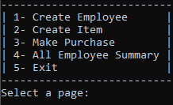

# Scenario:
Write a program for a retail store that will allow them to calculate discounts for their employees
when they buy items.
Discounts are based on the number of years worked (2% for each year, maximum 10%) as well
as if the employee is a manager (10% more discount on top of the worked year discount) or
hourly employee (2% discount). They are also allowed no discount once they have received $200
discount.
The program starts asking for the employee discount number to start purchasing. The employee
can purchase 1 item at a time. Do this until the user answers “NO” for “Another purchase?”.
Once all employees have been processed, display the All-Employee Summary and give the users
option to go back to Menu or Exit the program.

  

## Functionality
- Create Employee
- Create Item
- Make Purchase
- All Employee Summary
- Exit

- Get the code:
    ```
    git clone https://github.com/Fazlullahmamond/calculate-discounts.git
    ```

## License
Copyright (c) Mamond. All rights reserved.
